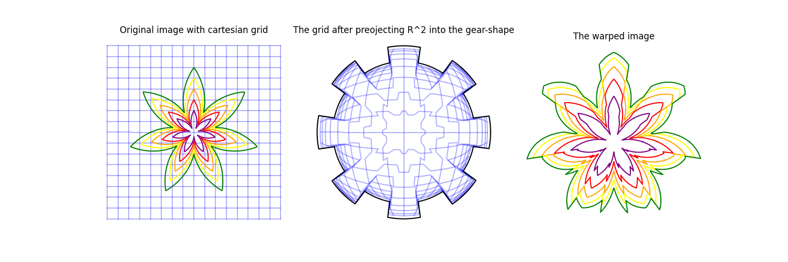
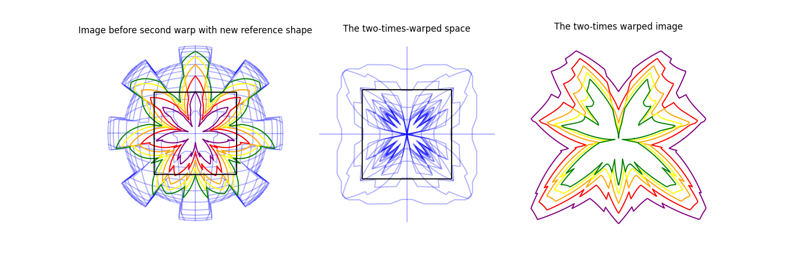
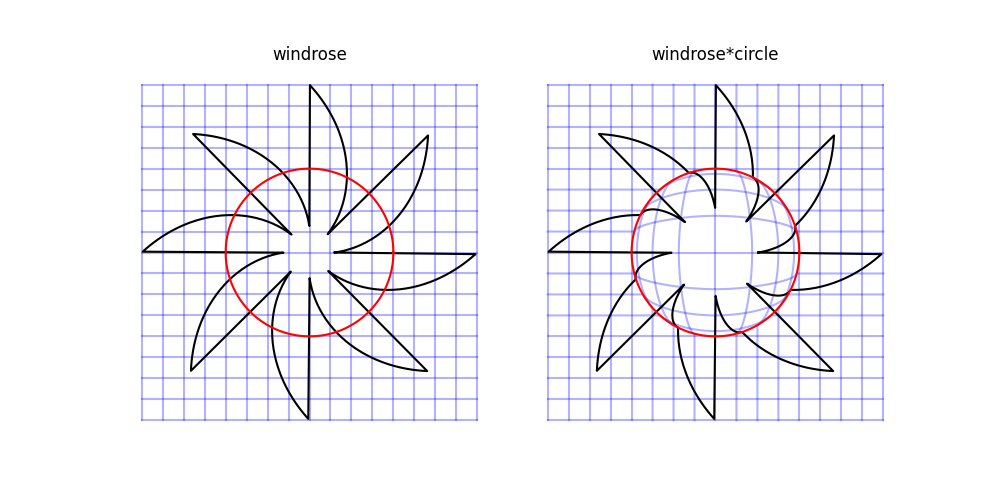

# Plane Warp
This is a small Python project for experimenting with transformations of the 2D plane.

2D-Shapes can be easily defined and then transformed by mappings, such as a fisheye-effect. The mappings are in turn parameterized by another shape, e.g. the fisheye-effect is parameterized by a reference-shape which defines the area of the effect (in the case of the fishye-effect, everything outside of the reference shape remains unaltered).

 A background grid can be transformed along with the shape, making it possible to visualize how the transformation deforms the plane itself.

This project has three targets:
1) fancy images,
2) easy to use,
3) nice code.

## Fancy Showcase
The code to create these images is contained in the function 'create_fancy_image' of 'demo.py'.

## Examples
Here are three simple examples. The red shape is the reference-shape that defines the shape of the warp, while the warped shape is plotted in black. The code to create these images is also contained in 'demo.py', see the function 'create_simple_examples'.

### Mirror the plane at the red circle:
In this transformation, the black shaped is projected to the other side of the red shape, along the ray that runs through the center point at (0,0).

### Construct a fisheye-effect inside the red circle:
Here, everything at the center of the red shape gets stretched outward, while everything near the inner boundary of the red shape gets squished. Outside of the red shape the image remains unaltered.

### Project the full R²-plane into the inside of the blossom-shape defined by the red outline:
The final transformation maps the whole R²-plane into the red shape. The further away from the center, the more the space gets squished, and infinity is mapped to the outline of the red shape. Since the red shape is not a circle, the amount of how much a specific area gets squished depends on where the area is positioned with respect to the red shape.

## Quick start
1) Define shapes:
To define a shape, use a ShapeConstructor
'''
import ShapeConstructor as SC
sc = SC.ShapeConstructor()
'''
and then create a shape-object, for example using one of the pre-defined distance-functions (these are functions f:(0,2\*pi)->R that map radians to angles, thus defining the outline of a shape in polar coordinates). For example, a windrose:
'''
import DistanceFunctions as DF
windrose = sc.construct_from_distancefct(DF.distfct_windrose, name="windrose")
'''
You don't have to specify a name, but the name of the shape can be used for plot titles.

Now to transform our windrose-shape into something fancy, we need to choose a transformation and a second shape to specify the scope of the transformation.
Let's implement a fisheye-effect on the interior of a square:
'''
square = sc.construct_from_distancefct(DF.distfct_square, name="square")
'''
And now, applying the transformation is straightforward, since the transformations are implemented as operators of shapes:
'''
fancy_fisheye_windrose = windrose\*square
'''
Now all that's left is to plot our transformed shape.
To this end, we only need to initialize a matplotlib-figure and get the axes-element.
With this, we can simply tell our shape to go plot itself:
'''
from matplotlib import pyplot as plt
ax = plt.gca()
fancy_fisheye_windrose.plot(ax)
plt.show()
'''

## Requirements:
Python 3.x (any reasonably recent version should do) with
- numpy
- matplotlib

## Project structure:
- 'Shapes.py': the main classes that handle shapes, shape construction and shape transformations
- 'Transformations.py': implementations of the spacial transformations.
- 'DistanceFunctions.py': implementations of functions that define shape-geometry.
- 'demo.py': examples, mainly all the code required to reconstruct the examples from this presentation.
- 'examples/': generated example images

## Possible future extensions:
- More default shapes.
- More transformations.
- A minimal web interface where users could create parameterized shapes and transformations without needing to code.
- Extend the idea to full images.