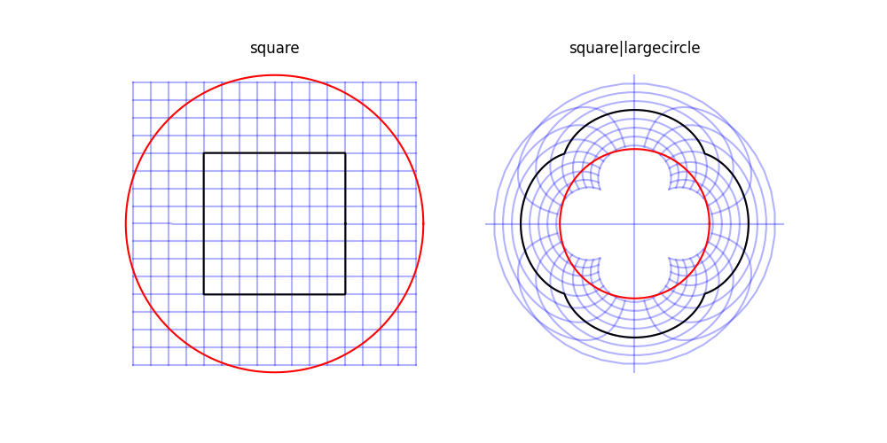
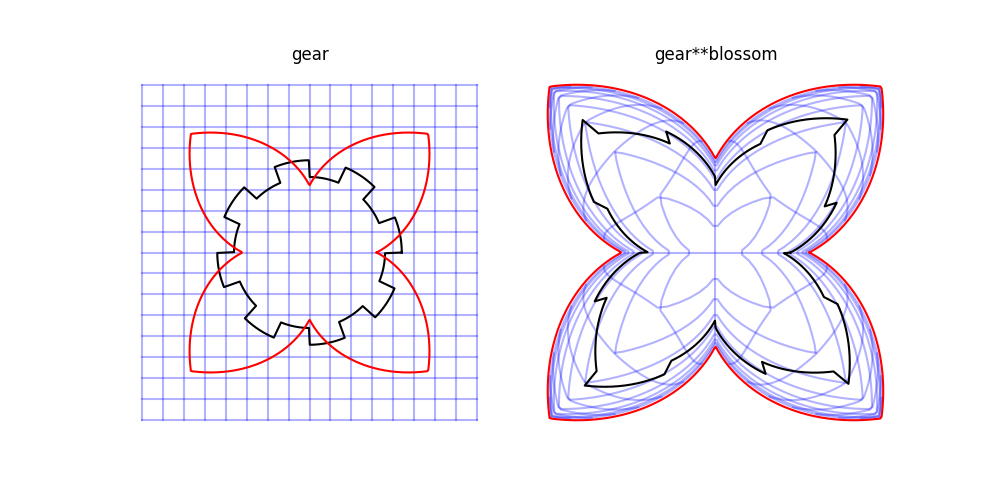

# Plane Warp
A small hobby project to construct interesting transformations of 2D-shapes.

## Examples
### Mirror the plane at the red circle:

### construct a fisheye-effect inside the red circle:

### project the full R²-plane into the inside of the blossom-shape defined by the red outline:

## How To
See 'demo.py' for a small demo that generates the images above.

## Requirements:
- numpy
- matplotlib
